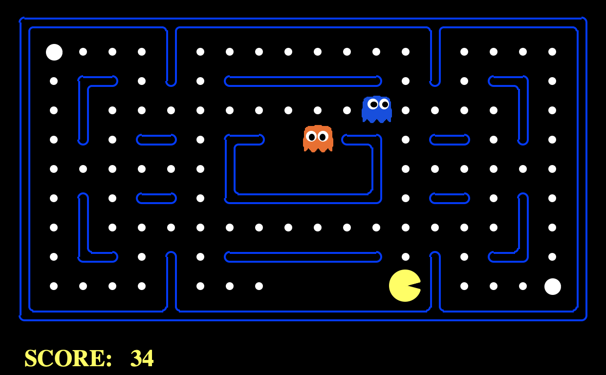

# 人工智能导论第一次作业-搜索实践

### 介绍

”[吃豆人]((https://en.wikipedia.org/wiki/Pac-Man))“是一款大家耳熟能详的游戏，本次作业需要结合课上学习的搜索相关知识，逐步实现一个吃豆人Intelligent Agent :)


### 文件结构

需要编辑的文件：

* search.py: 搜索算法实现。
* searchAgents.py: 问题定义与吃豆人Agent实现。
* multiAgents.py: 带博弈的吃豆人Agent实现。

需要阅读的文件：

* utils.py: 只需阅读前四类数据结构。
* pacman.py: ```GameState```类型。
* game.py: ```AgentState, Agent, Direction, Grid```等类型。


### 使用说明

进入目录，输入以下命令运行吃豆人游戏：

```
python pacman.py 
```



**游戏规则**：方向键控制移动，吃掉豆子得分，遇到怪物或吃完所有食物则游戏结束。另外，分数会随着游戏时间的进行逐渐减少，因此吃豆人需要在尽短的时间内吃掉所有食物。

代码中已经实现了一个最简单的GoWestAgent，运行以下命令：

```
python pacman.py --layout testMaze --pacman GoWestAgent
```

```GoWestAgent```是一个只会向左走的Agent，你可以在```searchAgents.py```找到它的实现。在```testMaze```迷宫中，它表现还不错，但在```tinyMaze```里就显得不那么智能，运行命令：

```
python pacman.py --layout tinyMaze --pacman GoWestAgent
```

这两个Demo展示了```pacman.py```支持的部分命令行参数：

* ```--layout```（或```-l```）：选择特定的迷宫，```layouts/```文件夹包含部分迷宫资源，其中```%```符号表示墙体，```P```表示起点，```.```表示食物，```G```代表怪物。

* ```--pacman```（或```-p```）：指定要使用的游戏Agent，默认为```KeyboardAgent```，即键盘输入。

查看更详细的参数说明：

``````
python pacman.py -h
``````


#### 问题一(15 Points)

首先我们将问题简化为：**不考虑怪物，让吃豆人吃到迷宫中的一个食物**，我们在```searchAgents.py```中写好了```SearchAgent```类的框架，它通过搜索算法得出到达目标的路径，依次执行动作。

首先我们测试```SearchAgent```是否运行正常：

````
python pacman.py -l tinyMaze -p SearchAgent -a fn=tinyMazeSearch
````

吃豆人成功抵达了终点！你可以在```search.py```找到```tinyMazeSearch```的实现。可以发现，它只是硬编码了从起点到终点的路径。

* ```-a```：```SearchAgent```使用该选项来接受```key=value```的字典对，用来指定```SearchAgent```使用的搜索算法和启发函数。例如：
  * ```fn=depthFirstSearch```: 使用深度优先搜索算法。
  * ```heuristic=euclideanHeuristic```: 使用欧几里得距离作为启发函数。

##### 作业要求

在```search.py```文件中实现```depthFirstSearch```, ```breadthFirstSearch```, ```uniformCostSearch```, ``aStarSearch``四种搜索算法，所有算法均返回一个动作列表（参考```tinyMazeSearch```），通过执行这些动作可以使吃豆人从起点抵达终点。

##### 提示

* 请仔细阅读```search.py```中的注释，尽可能调用```problem```对象的接口，你可以在```searchAgents.py```的```PositionSearchProblem```找到其实现。
* 请尽量使用```utils.py```中已有的数据结构。
* 你需要在```searchAgents.py```设计并实现```aStarSearch```可用的启发函数```yourHeuristic```。
* 实现后，你可以运行以下命令，对```layouts/```中的迷宫进行测试，例如：

```
python pacman.py -l tinyMaze -p SearchAgent -a fn=depthFirstSearch
python pacman.py -l mediumMaze -p SearchAgent -a fn=breadthFirstSearch
python pacman.py -l mediumMaze -p SearchAgent -a fn=uniformCostSearch
python pacman.py -l bigMaze -z .5 -p SearchAgent -a fn=aStarSearch,heuristic=yourHeuristic
```


#### 问题二(10 Points)

现在考虑更实际的情况：**迷宫中存在多个食物，甚至怪物，找到一条尽可能获得高分的路径**。

我们尝试基于已经实现的```uniformCostSearch```算法进行搜索，运行以下命令：

```
python pacman.py -l mediumDottedMaze -p SearchAgent -a fn=uniformCostSearch
```

如果实现正确，吃豆人只能吃到位于左下角处的食物，右侧的食物都浪费了。这是因为，SearchAgent默认选择左下角作为搜索的终点，同时迷宫中每个格子行走一步的代价都是固定值，因此，吃豆人选择了通往终点的最短路径。

如何改进呢？我们提供一种思路：修改格子的代价函数。例如，越往迷宫右侧，吃豆人行走一步的代价越低，运行以下命令：

```
python pacman.py -l mediumDottedMaze -p StayEastSearchAgent
```

##### 作业要求

请利用已实现的搜索算法和代价函数，在```searchAgents.py```实现```YOUR_SEARCH_AGENT```，尝试在迷宫中尽量获得高分：
```
python pacman.py -l mediumScaryMaze -p YOUR_SEARCH_AGENT
python pacman.py -l foodSearchMaze -p YOUR_SEARCH_AGENT
```

##### 提示

* 请仔细阅读```StayEastSearchAgent```示例，通过重写```searchAgent```的初始化函数，引入你选择的搜索算法和代价函数。
* 可以针对不同的迷宫设计不同的```SearchAgent```实现，但必须继承```SearchAgent```类且仅修改其```__init__```函数.


#### 问题三(20 Points)

我们考虑**地图中存在一些聪明的怪物**的情况，吃豆人的目标是获取尽量高分，而怪物们的目标阻止吃豆人获得高分，这是一个博弈问题。

##### 作业要求

请在```multiAgents.py```中实现`MinimaxAgent`和```AlphaBetaAgent```的类中的```getAction```方法，分别实现Minimax算法和Alpha-Beta剪枝算法，我们希望大家自己设计迷宫测试，测试命令为：

```
python pacman.py -p MinimaxAgent -l trappedClassic.lay -a depth=3
python pacman.py -p MinimaxAgent -l YOUR_MAZE_NAME -a depth=3
```

* ```depth=3```，指定了```Minimax```搜索树的决策深度，我们假设在吃豆人做出决策后，剩下的所有怪物依次做出决策，如此一轮后决策深度加一。根据你的算法效率，可以指定其他值。

##### 提示

* 请仔细阅读```multiAgents.py```文件中的注释；并查看```pacman.py```中```GameState```类的接口实现，请尽量调用这些接口。
* ```Minimax```树叶节点的```Utility```评估就是游戏界面中显示的分数，不需要大家实现。如果你正确实现了Minimax算法，在```trappedClassic```迷宫中，吃豆人会首先冲向离它最近的怪物（为什么？）
* 由于需要考虑多个怪物的情况，因此在```Minimax```搜索树中，一个```MAX```节点下依次有多层对应的```MIN节点```。
* 在Minimax算法中我们假定怪物每次都采取让吃豆人获得最低分数的动作，但实际上怪物的运动还附加一定的随机性，本次作业只要求大家正确实现对抗搜索算法。


### 最终提交

* 代码部分(45 Points)：只需修改**search.py**, **searchAgents.py**, **multiAgents.py**，**请不要修改项目中其他文件**。
* 文档部分(15 Points)，至少应包含如下内容：
  * 问题一：分析不同规模迷宫下，各搜索算法的用时，展开节点数，路径代价等指标，并说明你的启发函数是良定义的。
  * 问题二：简要说明搜索Agent的设计思路。
  * 问题三：上传自己设计的迷宫```.lay```文件，以及你所实现的对抗算法在迷宫中的运行效果录屏，分析Alpha-Beta剪枝是否降低了搜索代价。
  

在项目中遇到任何问题，欢迎在课程微信群中讨论。


